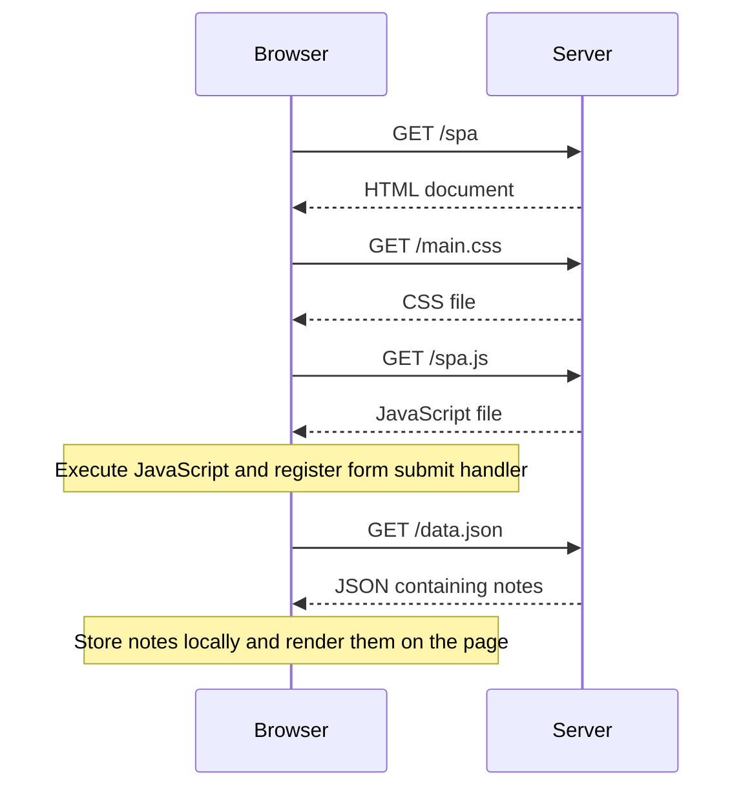

# 0.5 — Single-page app diagram

All request paths start with `https://studies.cs.helsinki.fi/exampleapp`.

```mermaid
sequenceDiagram
    participant browser as Browser
    participant server as Server

    browser->>server: GET /spa
    server-->>browser: HTML document
    browser->>server: GET /main.css
    server-->>browser: CSS file
    browser->>server: GET /spa.js
    server-->>browser: JavaScript file

    Note over browser: Execute JavaScript and register form submit handler
    browser->>server: GET /data.json
    server-->>browser: JSON containing notes
    Note over browser: Store notes locally and render them on the page
```
